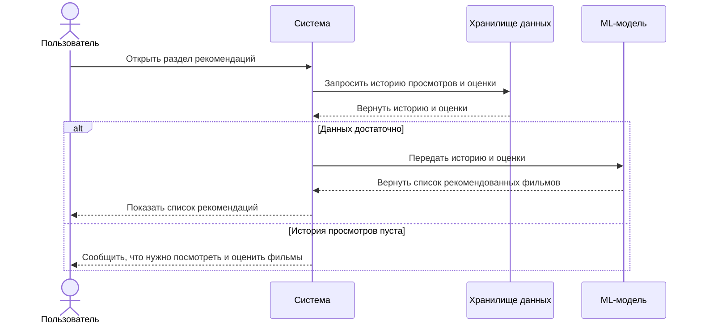
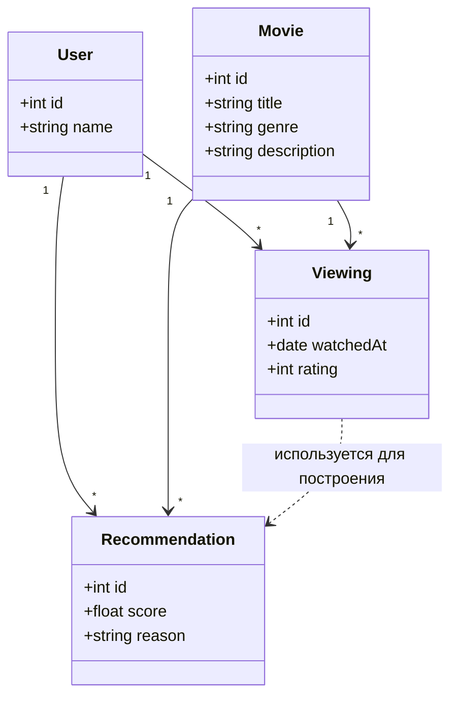

# Диаграммы

## Диаграмма последовательности

Получение персональных рекомендаций (UC-01).

```mermaid
sequenceDiagram
    actor User as Пользователь
    participant System as Система
    participant DB as Хранилище данных
    participant Model as ML-модель

    User->>System: Открыть раздел рекомендаций
    System->>DB: Запросить историю просмотров и оценки
    DB-->>System: Вернуть историю и оценки

    alt Данных достаточно
        System->>Model: Передать историю и оценки
        Model-->>System: Вернуть список рекомендованных фильмов
        System-->>User: Показать список рекомендаций
    else История просмотров пуста
        System-->>User: Сообщить, что нужно посмотреть и оценить фильмы
    end
```

## Диаграмма классов

```mermaid
classDiagram

    class User {
        +int id
        +string name
    }

    class Movie {
        +int id
        +string title
        +string genre
        +string description
    }

    class Viewing {
        +int id
        +date watchedAt
        +int rating
    }

    class Recommendation {
        +int id
        +float score
        +string reason
    }

    User "1" --> "*" Viewing
    Movie "1" --> "*" Viewing
    User "1" --> "*" Recommendation
    Movie "1" --> "*" Recommendation
    Viewing ..> Recommendation : используется для построения
```
